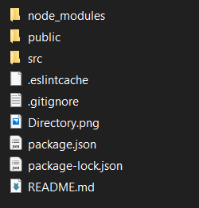

1. Type  -  "npx create-react-app ieee_event_frontend"  in terminal. 

2. Delete everthing in "ieee_event_frontend" folder excepet "node_modules" it is important to run app. 

3. Download this repo and paste all code to "ieee_event_frontend". 

4. Final folders look like below  

